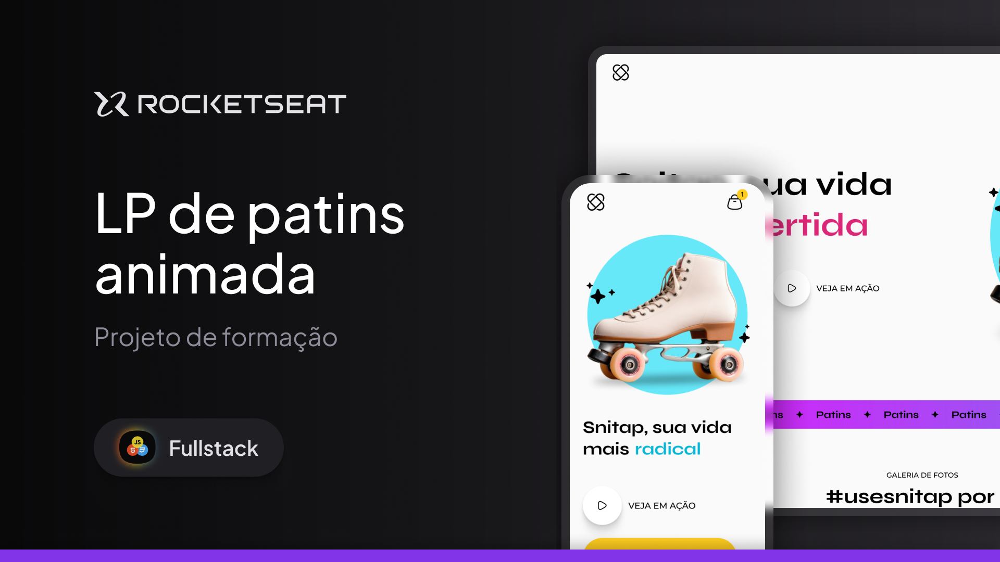

# Projeto landing page de patins animada - trilha Full Stack 

💻 Projeto Snitap

Este projeto é uma landing page para treinar animações CSS 

##  Tecnologias usadas no projeto

## Link da aplicação

👉🏼[Clique aqui para accessar](https://patins-projeto-animado.netlify.app/)

## 🔖 Layout

Você pode visualizar o layout do projeto através [desse link](https://www.figma.com/design/w77P9jtB3mSmmLvfidZGFm/LP-de-patins-animada-(Community)?node-id=915-685&node-type=frame&t=HMh2QtfDH2HnFFBX-0). É necessário ter conta no [Figma](https://figma.com) para acessá-lo.

## 🔗 Deploy 

## 💻 Sobre mim 😄
 Entusiasta da programação e estudante de Engenharia de Software com foco em        desenvolvimento front-end rumo ao full stack. Dedicado a criar experiências digitais inovadoras que impactam o mundo através da tecnologia.

## 🔗 Contato 

